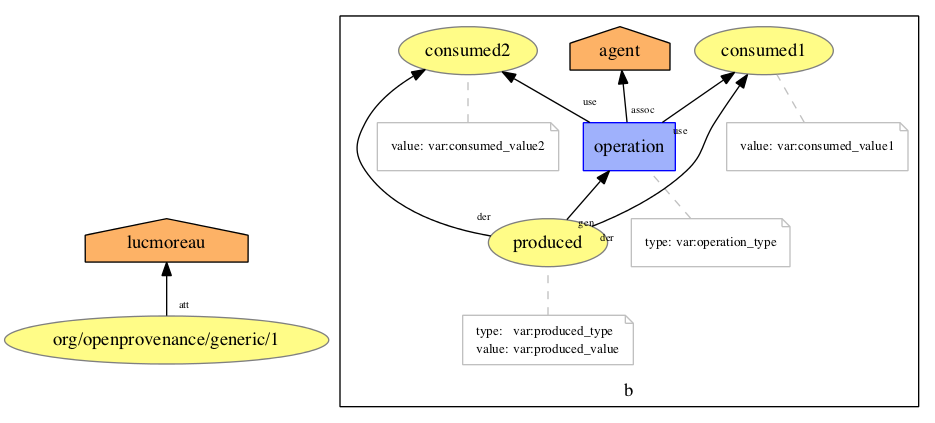

# Generic Templates

# Binary operation

In the box (a PROV bundle), the template shows an activity, two entities used as input and an entity generated as output. There is an agent associated with the activity. The output is derived from the two inputs.
This template for instance could be used to describe the addition of two numbers resulting in their sum.

On the left hand side, details of attribution.

