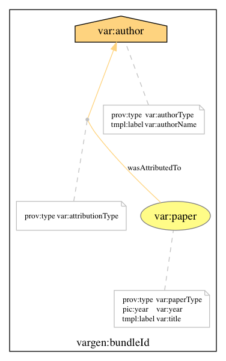
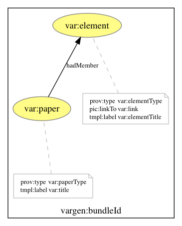
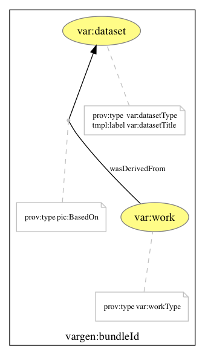
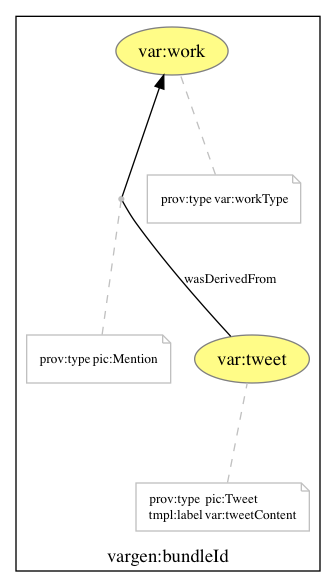
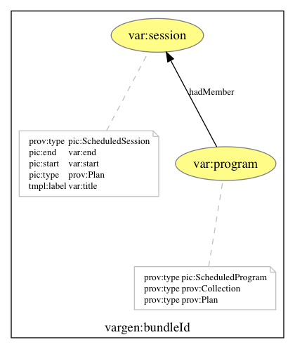

# PICASO templates

The PICASO application was designed to provide an easy way of asserting
provenance links between scientific objects, identified by their URIs. In order
to do so, PICASO was equipped with a number of templates describing common
relations between scientific objects like papers, datasets, slides, etc.

## Attribution

Adding authors, editors, etc. to publications

## Citation

Links to cited work

## Work-Element

Figures and tables in a paper

## Dataset-Usage

Dataset used in the preparation of a paper

## Derivation

Generic derivation between two entities

## Derived-Material

Posters/slides derived from a published work

## Presentation

Presenter presenting slides from their papers

## Tweet

Tweets mentioning a scientific work

## Conference-Session

Sessions in a conference’s program

## Project

People in a research project

